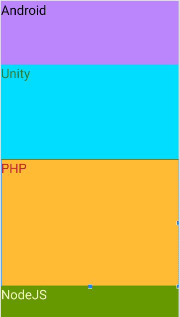

A ViewGroup is a special view that can contain other views (called children.) The view group is the base class for layouts and views containers.
There are many types of ViewGroup like:
- LinearLayout
    - Vertical (equal heigh):

    

    - Vertical (height with different weight):

    
    
- ConstraintLayout
- Toolbar
- RelativeLayout
- GridLayout
- FrameLayout