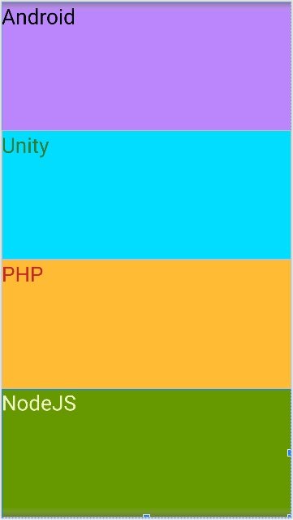
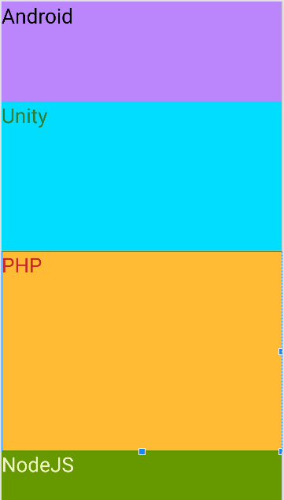
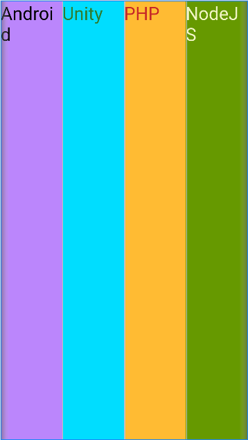
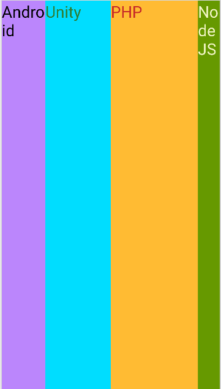
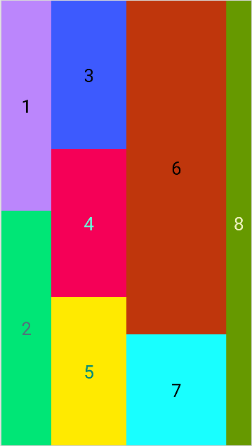

A ViewGroup is a special view that can contain other views (called children.) The view group is the base class for layouts and views containers.
There are many types of ViewGroup like:
- LinearLayout
    - Vertical (equal height):

    

    - Vertical (difference height):

    
    
    - Horizontal (equal width):

    

    - Horizontal (difference width):

    

    - Difference width and height:

    

- ConstraintLayout
- Toolbar
- RelativeLayout
- GridLayout
- FrameLayout